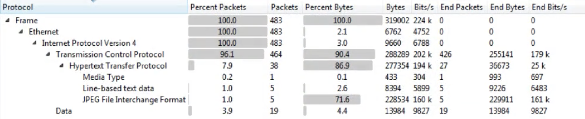

# Wireshark

[Wireshark](http://www.wireshark.com/) is a network protocol analyzer which is used to look at recorded network traffic. Wireshark uses a filetype called <mark style="color:orange;background-color:yellow;">.PCAP</mark> to record traffic

### Tutorial

The following tutorials are amazing to learn some cool basic tricks:

* [https://unit42.paloaltonetworks.com/unit42-customizing-wireshark-changing-column-display/](https://unit42.paloaltonetworks.com/unit42-customizing-wireshark-changing-column-display/)
* [https://unit42.paloaltonetworks.com/using-wireshark-display-filter-expressions/](https://unit42.paloaltonetworks.com/using-wireshark-display-filter-expressions/)
* [https://unit42.paloaltonetworks.com/using-wireshark-identifying-hosts-and-users/](https://unit42.paloaltonetworks.com/using-wireshark-identifying-hosts-and-users/)
* [https://unit42.paloaltonetworks.com/using-wireshark-exporting-objects-from-a-pcap/](https://unit42.paloaltonetworks.com/using-wireshark-exporting-objects-from-a-pcap/)

### Analyzed Information

#### Expert information

Clicking on _**Analyze** --> **Expert Information**_ you will have an **overview** of what is happening in the packets **analyzed**:

.png>)

#### **Resolved Addresses**

Under _**Statistics --> Resolved Addresses**_ you can find several **information** that was "**resolved**" by Wireshark like port/transport to protocol, mac to manufacturer...\
This is interesting to know what is implicated in the communication.

.png>)

#### **Protocol Hierarchy**

Under _**Statistics --> Protocol Hierarchy**_ you can find the **protocols** **involved** in the communication and data about them.

**Conversations**

Under _**Statistics --> Conversations**_ you can find a **summary of the conversations** in the communication and data about them.

.png>)

**Endpoints**

Under _**Statistics --> Endpoints**_ you can find a **summary of the endpoints** in the communication and data about each of them.

.png>)

**DNS info**

Under _**Statistics --> DNS**_ you can find statistics about the DNS request captured.

.png>)

### Filters

Here you can find Wireshark filter depending on the protocol: [https://www.wireshark.org/docs/dfref/](https://www.wireshark.org/docs/dfref/)

Other interesting filters:

* `(http.request or ssl.handshake.type == 1) and !(udp.port eq 1900)`
  * HTTP and initial HTTPS traffic
* `(http.request or ssl.handshake.type == 1 or tcp.flags eq 0x0002) and !(udp.port eq 1900)`
  * HTTP and initial HTTPS traffic + TCP SYN
* `(http.request or ssl.handshake.type == 1 or tcp.flags eq 0x0002 or dns) and !(udp.port eq 1900)`
  * HTTP and initial HTTPS traffic + TCP SYN + DNS requests

### Search

If you want to **search** for **content** inside the **packets** of the sessions press _CTRL+f_\
\_\_You can add new layers to the main information bar _(No., Time, Source...)_ pressing _right bottom_ and _Edit Column_

Practice: [https://www.malware-traffic-analysis.net/](https://www.malware-traffic-analysis.net)

## Identifying Domain

You can add a column that show the Host HTTP header:

.png>)

And a column that add the Server name from an initiating HTTPS connection (**ssl.handshake.type == 1**):

.png>)

## Identifying Local Host Name

### From DHCP

In current Wireshark instead of `bootp` you need to search for `DHCP`

.png>)

### From NBNS

.png>)

